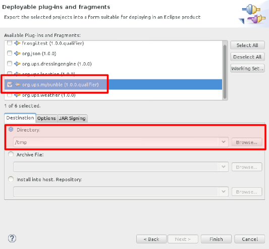
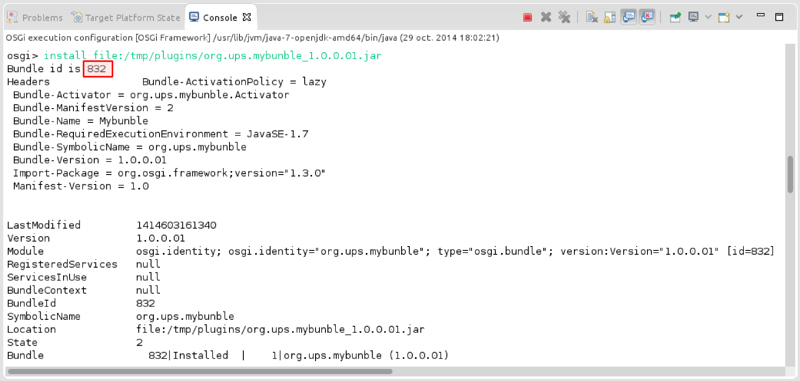
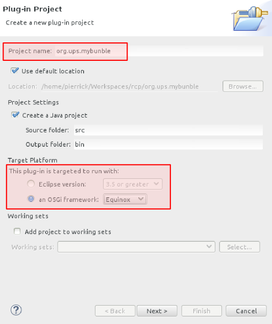
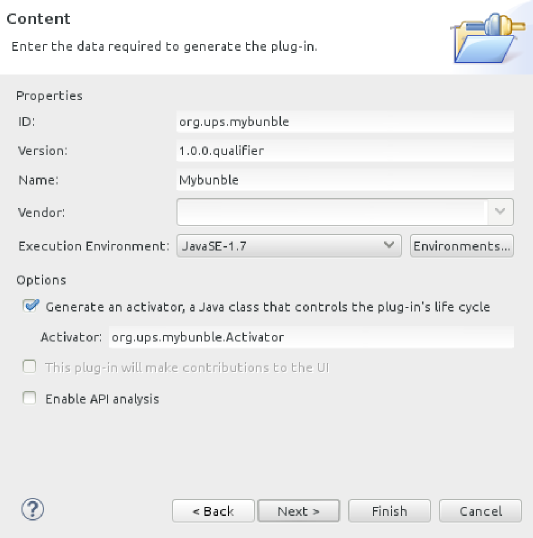
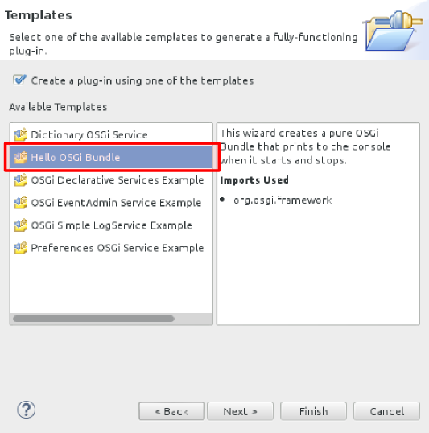
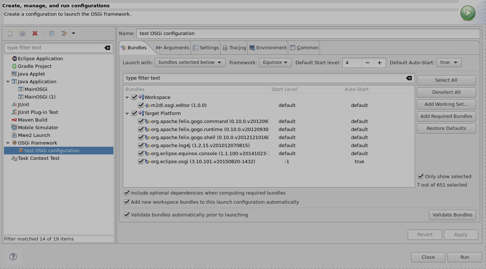

:numbered:
:toc:

= Sujet de TP d'OSGi
Pierrick MARIE

Licence : Creative Commons (BY-NC-SA 3.0) http://creativecommons.org/licenses/by-nc-sa/3.0/deed.rf

NOTE: Pour réaliser les TP, il faut télécharger l'IDE *Eclipse RCP*, et avoir installé Java 8 et JavaFX.
Vous pouvez télécharger Eclipse à partir de cette adresse : http://eclipse.org/downloads/packages/eclipse-rcp-and-rap-developers/lunasr1

Avant de commencer les TP il faut télécharger le code source mis à votre disposition à cette adresse : https://pierrickmarie.info/enseignements/osgi/sujet-tp.tar.gz
L'archive est constituée de quatre projets Java :

 * run.osgi.from.java-main : pour lancer la plateforme OSGi depuis un programme Java
 * m2dl.osgi.editor : le visualisateur de code source que vous devez compléter
 * example.osgi.service-provider : un exemple de déclaration de service OSGi
 * example.osgi.service-consumer : un exemple d'utilisation de service OSGi

== Exercice 1 : Prise en main d'OSGi

=== Lancer OSGi

Pour lancer OSGi, exécutez le programme Java qui se trouve dans le projet _run.osgi.from.java-main_ en ayant pris soin avant de :
 - 1/ modifié la ligne 14 pour indiquer le bon chemin vers le répertoire d'installation de Eclipse RCP ;
 - 2/ commenté avant la ligne 35 ;
 
Une fois lancé, une nouvelle de OSGi est accessible via la commande telnet : _telnet localhost 8080_.

Connectez-vous via telnet à OSGi et listez les bundles qui y sont installés avec la commande _ss_.

WARNING: Gardez OSGi lancé, nous en avons besoin juste en dessous !

=== Exporter des bundles

Dans un premier temps vous allez  exporter les deux projets _example.osgi.service-provider_ et _example.osgi.service-consumer_ comme des bundles OSGi.
Pour ça, après avoir sélectionné le projet à exporter :

 * Dans le menu principal, cliquer sur `Fichier` -> `Export...`;
 * Dans la nouvelle fenêtre, sélectionner `Deployable plug-ins and fragements`, cliquer sur `Next`;
 * Sélectionner votre bundle ainsi que le dossier où il sera exporté (en .jar);
 * Cliquer sur `Finish`.

*Exemple :*

WARNING: À partir du dossier que vous aurez choisi pour exporter votre bundle, Eclipse crée un dossier nommé « _plugins_ » et insère dans ce nouveau dossier les .jar qu'il génère.

==== Installer des bundles

Pour installer le bundle fraîchement exporté, nous allons utiliser l'invite de commande disponible depuis telnet.
Cette partie sert à vous faire découvrir les commandes de bases utilisables sur la plateforme OSGi.
Par la suite, Eclipse installera pour nous le bundle automatiquement.

Pour installer le bundle sur la plateforme OSGi il faut utiliser la commande `install`. 
Elle s'utilise de la manière suivante : *install file:/LE_PATH_VERS_OÙ_SE_TROUVE_LE_.JAR*

WARNING: N'oubliez pas le « _file:_ » devant le path !

Si tout s'est bien passé, le bundle est bien installé sur la plateforme OSGi.
Utiliser la commande *ss* pour vérifier que le bundle est bien installé.

*Exemple :*

Notez que la première ligne de log indique l'identifiant de votre bundle.
Grâce à cet identifiant vous pouvez exécuter votre bundle à l'aide de la commande *start* suivi de l'identifiant du bundle.

Effectuez les opération d'installation et de démarrage pour les deux projets _example.osgi.service-provider_ et _example.osgi.service-consumer_.

Si tout s'est bien passé, un `I say hello!` sauvage apparaît, et vous venez d'exécuter votre premier bundle OSGi. Félicitation !
Utiliser la commande *ss* pour constater que le statu des bundles a changé.

Maintenant que le bundle est démarré, arrêtez le à l'aide de la commande *stop* suivie de l'identifiant du bundle.
Utiliser la commande *ss* pour vérifier que le statu du bundle a encore changé.

Vérifiez que vous pouvez démarrer et arrêter les bundles dans n'importe quel ordre.

== Exercice 2 : Créer son premier bundle

Le but de ce TP est de créer pas à pas un bundle OSGi.

=== Créer un nouveau Plug-in Project

Pour créer votre premier bundle OSGi, suivez les instructions suivantes :

 * Cliquer sur File -> New -> Plug-in Project
 * Dans la nouvelle fenêtre qui vient d'apparaître, remplir le nom du projet
 * Sélectionner la `Target Platform` appropriée, dans notre cas, *OSGi framework* avec *Equinox*.

*Exemple :*

Cliquer sur `Next` et observer dans la nouvelle page qui vient d'apparaître les différents champs qui composeront la première partie du fichier MANIFEST.MF (les méta-données de votre bundle).

*Exemple :*

Cliquer sur `Next` et utiliser le template _Hello OSGi Bundle_.

*Exemple :*

Cliquer sur `Finish`. 

 * Observer le contenu du fichier `Activator.java` et repérer le contenu des méthodes `start(BundleContext)` et `stop(BundleContext)`;
 * Observer le contenu du fichier `MANIFEST.MF` et retrouver les informations relatives au nom et au numéro de version du bundle.  Remarquer le contenu de la ligne `Import-Package`, votre bundle utilise le package `org.osgi.framework`. C'est dans ce package que se trouve les classes BundleContext et BundleActivator utilisées dans votre classe `Activator`.

Une fois votre bundle nouvellement crée, reprenez les instructions de l'exercice 1 pour l'exporter puis l'installer et le démarrer dans la plate-forme OSGi que vous avez lancé en début de séance.

Vous pouvez ensuite arrêter la plate-forme OSGi.

== Exercice 3 : exécuter OSGi depuis Eclipse

Pour lancer vos bundles directement depuis Eclipse, sans passer par les phases d'export et d'installation il faut créer une nouvelle configuration.

Dans le menu principal, cliquer sur Run → Run Configurations. Créer une nouvelle configuration OSGi Framework. Le but est de créer un environnement d’exécution minimaliste avec seulement les bundles dont on a besoin.

Cliquer sur le bouton Deselect All;

Sélectionnez parmi la liste de tous les bundles disponibles ceux listés à la ligne 56 du main du projet _run.osgi.from.java-main_ et uniquement ceux-la !

Sélectionnez également les bundles que vous êtes en train de développer et que vous voulez tester.

*Exemple :*

Cette méthode d'exécution des bundle est la plus rapide, privilégiez celle-là pour la phase de développement.

== Exercice 4 : lancer la fenêtre graphique JavaFX

Avant de lancer le bundle _m2dl.osgi.editor_, vous devez remplacer le fichier jar _jfxrt.jar_ (qui contient la bibliothèque JavaFX) par celui provenant de votre installation de JavaFX.
Pour cela, regardez dans votre répertoire d'installation de Java8 (par exemple _/usr/lib/jvm_) et remplacez le jar _jfxrt.jar_ du projet par celui issus de votre installation.

Une fois cette étape terminée, vous pouvez lancer ce nouveau bundle en suivant les décrites dans l'exercice 3.

== Consignes pour le projet

=== Description générale

L'objectif du projet est de développer un visualisateur de code source qui propose une coloration syntaxique pour des fichiers Java et CSS.
La coloration syntaxique est gérée dans des bundles que vous devrez développer.
Sans ces bundles, le programme doit afficher le code source des fichiers sources sans coloration.

Vous devez compléter les fonctionnalités de l'interface graphique du projet _m2dl.osgi.editor_, voir la classe _CodeViewerController_.
Chacune des méthodes de cette classe correspond à une action effectuée par l'utilisateur sur l'interface.

Le bouton 'Load bundle' permet à l'utilisateur de sélectionner un bundle à installer et lancer pour fournir la fonctionnalité de coloration syntaxique.
L'utilisateur doit donc pouvoir choisir quels sont les bundles qu'il veut installer à chaque fois qu'il lance le programme.

Les radioboutons 'CSS bundle' et 'Java bundle' permettent de démarrer ou arrêter les bundles portant respectivement sur la coloration syntaxique des fichiers CSS et Java.

=== Gestion de la coloration syntaxique

Pour afficher le code source des fichier avec de la couleur vous utiliserez le composant _webView_ (déjà intégré dans l'IHM du programme) qui interprète et affiche des documents HTML.
Vous allez donc devoir transformer un code source en document HTML pour pouvoir l'afficher correctement dans le visualisateur de code.

*Exemple :*

Le code source à afficher est le suivant :

 package activator;
 public class Activator implements BundleActivator {
 }

Après transformation et pour l'affichage le document est :

 <html>
 <head></head>
 <body>
 package activator;  
 public class Activator implementsBundleActivator {  
 }
 </body>
 </html>

Pour gérer la coloration syntaxique, voici la méthode en employer :

 - *1/* après l'ouverture d'un fichier source, décorer les mots clés du fichier par des balises que vous définirez. Par exemple, pour un fichier Java, vous allez entourer les mots "class" avec la balise ":keyword{ ... }" et les commentaires par la balise ":comment{ ... }". L'objectif de cette étape est d'identifier les parties clés du langage qui doivent être affichées avec de la couleur. Dans l'exemple précèdent cela donnerai :

 :keyword{package} activator;
 :keyword{public class} Activator :keyword{implements} BundleActivator {
 }

 - *2/* récupération de la chaîne de caractère qui contient le fichier avec vos balises. Dans cette étape pour devrez transformer vos balises en code HTML comme montré dans l'exemple ci-dessus.

Le but de l'étape 1 est d'anticiper de futurs évolutions du programme. Si plus-tard, l'affichage de code avec de la coloration syntaxique ne repose plus sur de l'HTML, il suffit simplement de modifier l'étape 2.
Pour réaliser les deux étapes, vous utiliserez des expressions régulières...

Vous devrez donc développer 3 bundle :

 - un pour réaliser la première étape, il contient la logique du logiciel. Il devra placer ses balises selon si le fichier ouvert est du Java ou du CSS.
 - un pour s'occuper de l'affichage de fichiers HTML
 - un pour s'occuper de l'affichage de fichiers CSS

=== Contraintes

 - Vous pouvez réaliser le projet seul ou à deux ;
 - Vous devrez spécifier correctement le MANIFEST de vos bundle. Ce qui comprend :
   * les packages qui contiennent les interfaces que vous exportez
   * les packages qui contiennent les interfaces que vous importez
   * le numéro de version des packages exportés
   * le numéro de version des packages importés
 - Vous devez rendre pour le 30 Janvier :
  * le bundle _m2dl.osgi.editor_ que vous aurez complété
  * les trois bundles que vous devez développer
  * un projet Java, le main, qui va lancer une nouvelle instance de OSGi avec le bundle _m2dl.osgi.editor_, pour ça, inspirez vous du projet _run.osgi.from.java-main_
 - Il faut pouvoir installer et lancer les bundles dans n'importe quel ordre. Pour vous aider, regardez la méthode 'installAndStartBundle' (ligne 18) du main du projet _run.osgi.from.java-main_.
 - Vous serez noté sur votre capacité à développer des bundles, pas sur votre capacité à colorer l'ensemble des mots des fichiers ouverts. Concentrez vous donc en priorité sur les bundles plutôt que sur l'algorithme de coloration.
 - Have fun !
